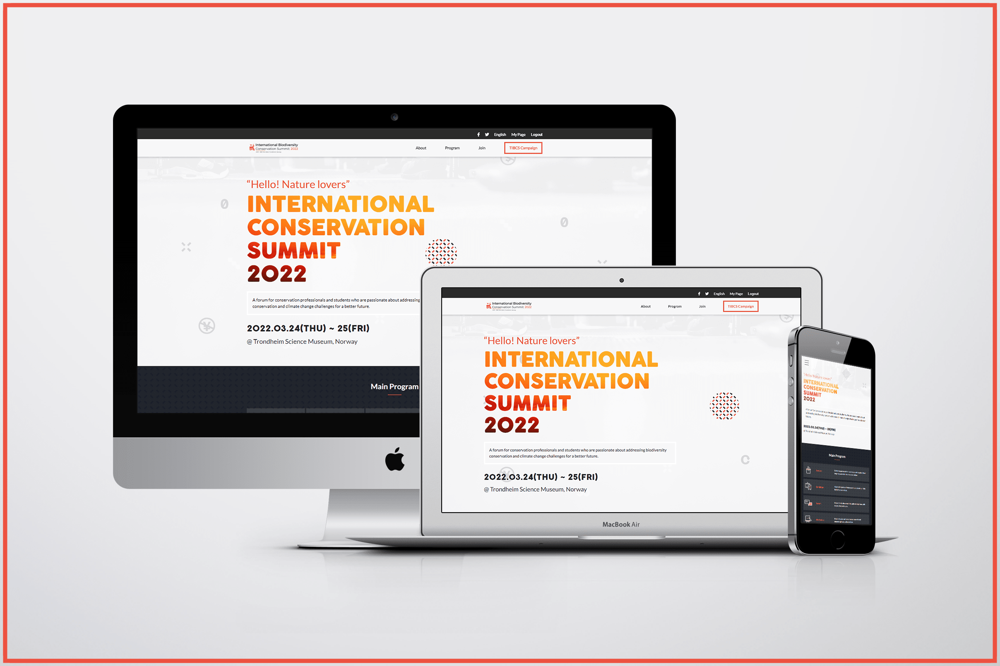

# Module 1 Capstone project

## International Conservation Summit 2022

> This is a capstone project for the first module of the Microverse curriculum. In this project, I built a dummy website for a biodiversity conservation conference. 

## Screenshot

## Built With

- HTML
- CSS/SCSS
- Flexbox
- CSS Grid
- JavaScript
- Mobile-first workflow

## Live site 🚀

🔗 [Live Site Link](https://dewslyse.github.io/Capstone1-mv/)

## Getting Started

To get a local copy up and running follow this simple step:

- Clone repository to your local machine: `git clone git@github.com:dewslyse/Capstone1-mv.git`

## Author

👤 **dewslyse**

- GitHub: [@dewslyse](https://github.com/dewslyse)

## 🤝 Contributing

Contributions, issues, and feature requests are welcomed!

Feel free to check the [issues page](../../issues/).

## Show your support

Give a ⭐️ if you like this project!

## Acknowledgments

Original design idea by [Cindy Shin in Behance](https://www.behance.net/gallery/29845175/CC-Global-Summit-2015).

## 📝 License

This project is [MIT](./LICENSE) licensed.
